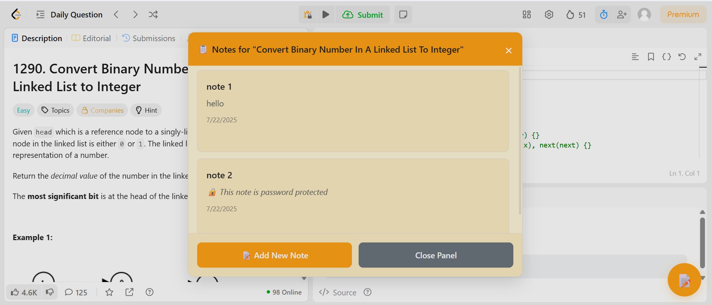
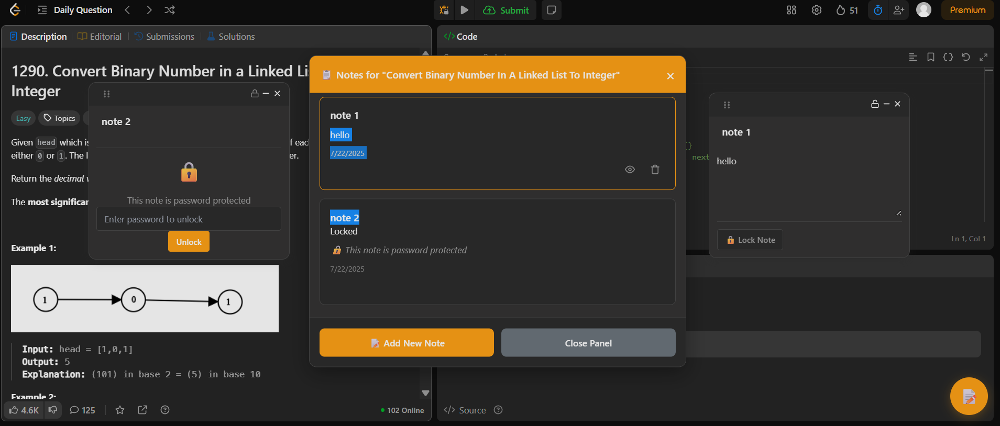

# 📝 LeetCode Sticky Notes
[](https://leetcode.com/)

A **Google Chrome Extension** that lets you add **draggable sticky notes** directly on LeetCode problems. Notes are **saved persistently in local storage**, can be **locked with a password**, and are organized neatly in a **popup dashboard**.

---

## Features

**Draggable Sticky Notes** – Place notes anywhere on LeetCode problem pages.  
**Persistent Storage** – Notes automatically save and reload when you revisit problems.  
**Password Protection** – AES-GCM encryption + salted password hashing for secure notes.  
**Problem-Aware Notes** – Each note is tied to a specific problem’s slug and title.   
**Popup Dashboard** – Search, sort, export, and delete all notes from one place.   

---

## Video Demo

[](https://youtu.be/uzi-zAEZq9Q)

*(Click the badge above to watch the full demo video)*

---

## Screenshots

### Sticky Notes on a LeetCode Problem


### 🗂️ Multiple Notes on a Single Problem


### 📋 Popup Notes Dashboard


---

## Installation

### **From Source (Developer Mode)**

1. **Clone or download** this repository.
2. Open Chrome and go to:  
   `chrome://extensions/`
3. Enable **Developer Mode** (top-right corner).
4. Click **Load unpacked** and select the extension folder (where `manifest.json` is located).
5. Open Leetcode and start Working.

---

## Usage

### **On LeetCode Problem Pages**
- Click the floating **📝 button** to open notes.
- Drag, edit, minimize, or hide notes as needed.
- **Lock Notes:** Click the lock icon or set a password for privacy.

### **In the Popup Dashboard**
- Search by **title, content, or problem**.
- Sort by **recent, oldest, problem, title, or content size**.
- Click a note to jump directly to its problem.

---

## Tech Stack

- **Manifest V3 Chrome Extension**  
- **JavaScript**  
- **Web Crypto API** – Encryption & password hashing  
- **Chrome Storage API** – Persistent local storage  
- **Popup UI** – HTML/CSS/JS  

---

## Project Structure

```
├── background.js        # Handles storage, encryption, and messaging
├── content.js           # Injects sticky notes UI into LeetCode pages
├── popup.html           # Popup dashboard
├── popup.js             # Search, sort, export, and clear functionality
├── util.js              # Utility functions (title generation, HTML escaping)
├── manifest.json        # Chrome Extension Manifest (v3)
├── icons/               # Extension icons (16x, 48x, 128x)
└── styles/              # CSS for content and popup
```

---

## Permissions
This extension uses minimal permissions:
- `storage` – Save notes locally.  
- `activeTab` – Interact with the current tab.  
- `https://leetcode.com/*` – Inject notes only on LeetCode.
