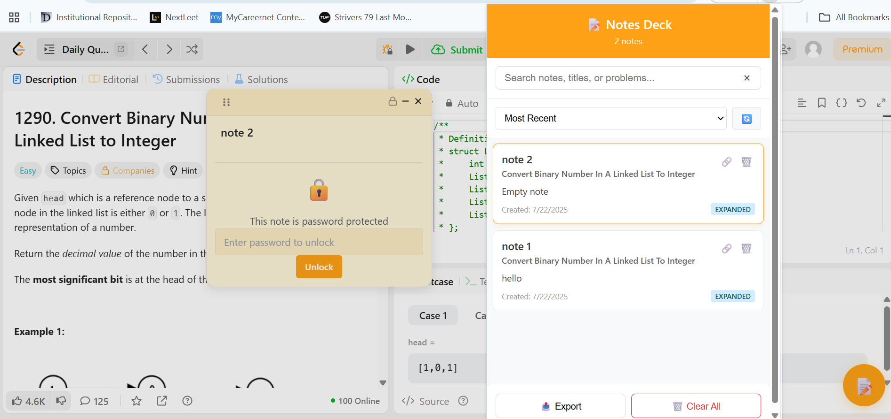

# 📝 LeetCode Sticky Notes

A **Google Chrome Extension** that lets you add **draggable sticky notes** directly on LeetCode problems. Notes are **saved persistently in local storage**, can be **locked with a password**, and are organized neatly in a **popup dashboard**.

---

## Features

1. **Popup Dashboard** – Search, sort, export, and delete all notes from one place.  
2. **Persistent Storage** – Notes automatically save and reload when you revisit problems.  
3. **Password Protection** – AES-GCM encryption + salted password hashing for secure notes.  
4. **Problem-Aware Notes** – Each note is tied to a specific problem’s slug and title.   
5. **Draggable Sticky Notes** – Place notes anywhere on the page.

---

## Video Demo

*(Click the badge above to watch the full demo video)*

---

## Screenshots

### A separate Panel for each Problem/Page

### Popup Dashboard where are notes are displayed irrespective of problem

### Dark Mode for the Nocturnals

---

## Installation

### **From Source (Developer Mode)**

1. **Clone or download** this repository.
2. Open Chrome and go to:  
   `chrome://extensions/`
3. Enable **Developer Mode** (top-right corner).
4. Click **Load unpacked** and select the extension folder (where `manifest.json` is located).
5. Open Leetcode and start Working.

---

## Tech Stack

- **Manifest V3 Chrome Extension**  
- **JavaScript**  
- **Web Crypto API** – Encryption & password hashing  
- **Chrome Storage API** – Persistent local storage  
- **Popup UI** – HTML/CSS/JS  

---

## Permissions
This extension uses minimal permissions:
- `storage` – Save notes locally.  
- `activeTab` – Interact with the current tab.  
- `https://leetcode.com/*` – Inject notes only on LeetCode.
